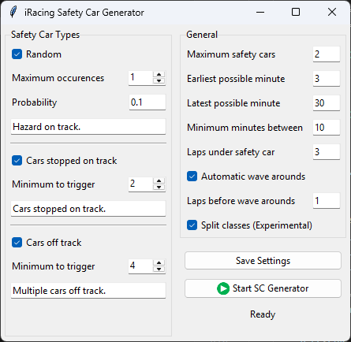

# iRacing Safety Car Generator

This program is designed to trigger safety car events in iRacing with more control than the built-in automatic yellows in iRacing, with adjustable settings.



## Usage

1. Set your settings in the application window, then click the `Save Settings` button. This will write your settings to a file and load them back up next time you launch the app.

2. Launch your iRacing simulator session.

3. Once in the simulator, click the `Start SC Generator` button. The app should indicate it is "Connected to iRacing".

4. The app will wait for the race to start and then monitor for any of the incident thresholds to be met to throw a Safety Car event.

5. Important: do not use chat while the generator is running as the app uses automated chat inputs to send commands to the simulator. When yellows are thrown, also make sure to not alt-tab around your running programs as iRacing will need to maintain focus to send the commands.

## Developer documentation

The desciptions below go into the nitty gritty of how the app functions and is documented to help users and other developers understand some of the mechanics utilized to make the app work around some of the SDK limitations.

### Run the application

```
# Clone the repository (or use your own fork!)
git clone git@github.com:joshjaysalazar/iRacingSafetyCarGenerator.git

# Set up your python virtual environment
python -m venv myenv

# Install dependencies
pip install -r requirements.txt

# Run vanilla mode (from src)
python main.py

# Run dev mode (from src)
python main.py -dev

# Run on a non-Windows machine (mocks the Windows-only pywinauto dependency)
python main.py -dev -dwi

```

# Test the application
```
# These are all optional packages to run tests; pytest is really the only one you need to just run tests once
pip install pytest
pip install pytest-watch

# To run the tests once
pytest

# To run tests as you make changes
ptw

```

# Building for distribution

## Local Building

To build a self-contained Windows executable for distribution locally:

```
# Using the Python script directly
python build.py
```

Build options:

```
# Build with a specific version number (default is current date in YYYY.MM.DD format)
python build.py --version 1.2.3

# Create a ZIP archive of the distribution
python build.py --zip

# Clean build directories without building
python build.py --clean-only

# Force building on non-Windows platforms (for testing)
python build.py --force
```

The executable and all required files will be placed in the `dist` directory. You can distribute this to users who can run the application without needing to install Python or any dependencies.

## GitHub Actions Workflow

This repository includes a GitHub Actions workflow that can build the application on-demand from any branch. This is useful for testing builds from feature branches or creating official releases.

### Running the Workflow

1. Navigate to the "Actions" tab in the GitHub repository
2. Select the "Build Windows Executable" workflow from the sidebar
3. Click the "Run workflow" dropdown button
4. Configure the workflow parameters:
   - **Branch to build**: Select the branch to build (default: 'main')
   - **Version number**: Optionally specify a version number (e.g., '1.2.3'); leave empty for auto-versioning based on date
   - **Create GitHub Release**: Check this to create a GitHub release with the built artifacts
   - **Release name**: Optionally specify a custom release name (if creating a release)
   - **Mark as pre-release**: Check this to mark the release as a pre-release
5. Click "Run workflow" to start the build

### Workflow Outputs

The workflow will:
1. Build the executable for Windows
2. Create a ZIP archive of the distribution
3. Upload build artifacts to the workflow run
4. (Optional) Create a GitHub release with the ZIP file attached

You can download the built artifacts from the completed workflow run, or from the GitHub release if one was created.

### High level execution

At a high level, the app waits for the race to start, then checks against all conditions as configured in the app, looping approximately every second. "Approximately" because we wait for a second at the end of a loop, but the loop itself obviously also takes some time.

Steps:
* Update the latest information on all drivers
* Check if we are in an eligible window to throw a Safety Car
* Check the thresholds set for random events, stopped cars and offtrack cars
* If any of the thresholds are met, start the Safety Car procedure
* After the procedure, start looping again

### Waiting for green

* Waits for the race session to begin
* Waits for the green flag to be thrown
* Note that in its current iteration, the app will not work when started _after_ the green flag is shown. In the developer tools a "Skip wait for green" button was added to make testing easier.

### Driver updates

* On each iteration, we update all of the info we track of all drivers
* Before doing so, we keep a copy of the current information so that we can look at the delta
* The information gathered is:
    * Laps completed
    * The current lap distance (as a fraction of the total lap)
    * The surface the car is on (on or off track, pit, etc.)

### Eligible Safety Car window

**Start and end time**: The start time of the race is recorded when the green flag is shown. Safety cars will only be thrown between the start ("Earliest possible minute") and end ("Latest possible minute") time.

**Time since last Safety Car**: Safety Cars will not be thrown when the last Safety Car occurred within the set "Minimum minutes between" time. Note that this time is currently recorded _at the start_ of a Safety Car event, not when it ends.

**Max Safety Car events**: When the "Maximum safety cars" has been reached, the app stops monitoring for Safety Car events.

### Random events

We generate a random number and check if that number is smaller than the odds of the event occurring at any second. Takes into account the overall window length.

### Stopped cars events

* For each driver, we check their laps completed and current lap distance to calculated their total distance. Note: current lap distance is represented as a fraction of the total lap rather than the actual distance.
* We compare this to their total distance from the previous loop iteration. If it is the same, the car is stopped.
* When the threshold of stopped cars is met, we throw a Safety Car event.

We account for:
* Any lag issues (resulting in all cars being marked as stopped)
* Cars in the pit
* Cars not currently active
* Cars with negative lap progress (possibly caused by an SDK glitch?)

### Off track events

* For each driver, we check their track location which indicates whether they're off track.
* We account for any negative lap progress, which may indicate an SDK glitch(?).
* When the threshold of off-track cars is met, we throw a Safety Car event.

### Safety Car procedure

When a Safety Car event is thrown, the following happens:

* The current lap is noted to be able to offset any of the events in the procedure accordingly.
* We wait until the lead car has done enough laps under Safety Car before throwing wave arounds. This is configured through the "Laps before wave arounds" setting.
* Based on the "Laps under safety car" setting, we will signal how many laps are left before green.
* We wait for the green flag to be shown before starting to monitor for events again.

#### Wave arounds

* First off, this is skipped if "Automatic Wave arounds" is unchecked.
* We noted earlier when the Safety Car event started, which is used to determine when the wave around signals should be sent, based on the "Laps before wave arounds" setting.
* Once the first car reaches the target wave lap, signals will be sent.
* We determine the lead car for all classes in the race.
* Cars are waved when:
    * A car is two laps down (i.e. crossed S/F 2 fewer times, which could also be a lap and a bit).
    * A car is a lap down AND are behind their class lead on the current lap.
* We send the wave commands for all cars who qualify for a wave-around with 0.5 second delay between each command.

### Developer mode

The `-dev` argument can be used to start the application in a dev mode, which will add a panel to the GUI with some developer tools (like "Skip wait for green" to make testing easier) and is your place to add any experimental features.

### References

* Basic irSDK usage: https://github.com/kutu/pyirsdk/tree/master/tutorials
* A list of variables available through the SDK: https://github.com/kutu/pyirsdk/blob/master/vars.txt
* Unofficial, more comprehensive, SDK docs: https://sajax.github.io/irsdkdocs/yaml

## License

This program is licensed under the [GNU General Public License Version 3](https://www.gnu.org/licenses/gpl-3.0.html).

## Author

This program was created by [Joshua Abbott Salazar](https://github.com/joshjaysalazar).

If you encounter any issues or have questions, please [report them on GitHub](https://github.com/joshjaysalazar/iRacing-Safety-Car-Trigger/issues).
