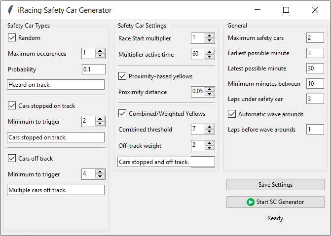

# iRacing Safety Car Generator

This program is designed to trigger safety car events in iRacing at random intervals during a race, with adjustable settings. It's in the early stages of development, so there may be bugs and issues.

## Usage

1. Set your settings in the applicaiton window, then click the `Save Settings` button.

2. Click the `Generate Safety Car Events` button while drivers are gridding for the race to begin the program.

3. Make sure to click back to the iRacing window so the program can send the necessary commands to trigger the safety car(s)!

## License

This program is licensed under the [GNU General Public License Version 3](https://www.gnu.org/licenses/gpl-3.0.html).

## Author

This program was created by [Joshua Abbott Salazar](https://github.com/joshjaysalazar).

If you encounter any issues or have questions, please [report them on GitHub](https://github.com/joshjaysalazar/iRacing-Safety-Car-Trigger/issues).
